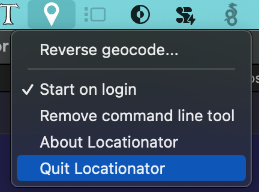
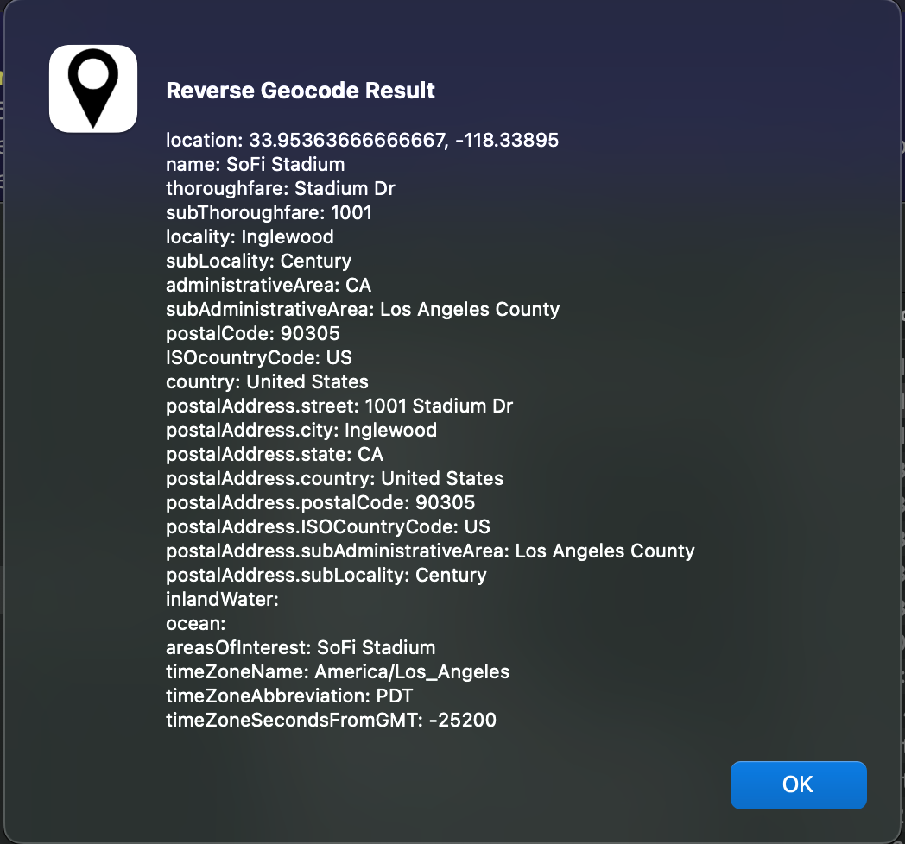

# Locationator
<!-- ALL-CONTRIBUTORS-BADGE:START - Do not remove or modify this section -->
[](#contributors-)
<!-- ALL-CONTRIBUTORS-BADGE:END -->

A simple macOS menubar app that provides access to the macOS Location Services reverse geocoding API. Also includes a command line tool for accessing the reverse geocoding API and for writing reverse geocoding data to the XMP metadata of image and video files as well as two services for accessing the reverse geocoding API from the Services menu.

## Rationale

Why this app? Apple's Location Services API is great and I wanted to be able to use the reverse geocoding API from the command line. Unfortunately, in Ventura, Apple has basically made it impossible to use Location Services from a command line app because the app cannot be granted the necessary permissions in System Settings. This app is a workaround for that problem. It creates a menubar app that can be granted the necessary permissions and then provides a simple API for accessing the reverse geocoding API via a built in web server. This means that you can use the Location Services API from the command line by making a simple HTTP request to the built in web server via curl for example or can use the API end point from any other app that can make HTTP requests.

## Installation

Download the latest release DMG from the [releases page](https://github.com/RhetTbull/locationator/releases) and use the DMG to install the app. Once installed, launch the app and grant it the necessary permissions.

To launch Locationator the first time you'll need to right-click on the app icon and select "Open" otherwise you may get a warning about unknown developer as the app is not signed with an Apple Developer ID. You may need to do this twice.

Alternatively, to build from source:

- clone the repo
- cd into the repo directory
- create a virtual environment and activate it
- python3 -m pip install -r requirements.txt
- python3 setup.py py2app
- Copy dist/Locationator.app to /Applications

## Screenshots





## Usage

Locationator server is a very simple HTTP server for handling local requests. It supports three endpoints, `GET /`, `GET /reverse_geocode`, and `GET /current_location`.

>*Please note*, this server is for local use and NOT intended to be exposed to the internet. The server does not support any authentication or authorization and is intended to be used on a local machine only.

### GET /

This endpoint provides the current version and the port on which the server is running.

**URL** : `/`

**Method** : `GET`

**Response format** : Content-type is plain text

**Success Response Example** :

*Note*: examples below use the [httpie](https://httpie.io/) command line tool for making HTTP requests. You can also use curl or any other tool that can make HTTP requests.

`http get localhost:8000`

or

`curl -X GET http://localhost:8000/`

```http
HTTP/1.0 200 OK
Content-type: text/plain
Date: Fri, 13 Oct 2023 16:16:42 GMT
Server: SimpleHTTP/0.6 Python/3.11.6

Locationator server version 0.0.1 is running on port 8000
```

### GET /reverse_geocode

Receive geocode queries from the client. This endpoint accepts GET requests with latitude and longitude data as query parameters, performs reverse geocoding and returns the result.

**URL** : `/reverse_geocode?latitude=double&longitude=double`

**Method** : `GET`

**Query Parameters** :

|Parameter|Type|Description|
|---|---|---|
|`latitude`|Double|Latitude of the location to be reverse geocoded|
|`longitude`|Double|Longitude of the location to be reverse geocoded|

**Note:**: This method may take several seconds to return a response if the CoreLocation service is unable to reverse geocode the location quickly. It will timeout after 15 seconds and return an error if a location cannot be determined.

**Response format** :

- On Success, Content-type is application/json and a response code of 200 with a JSON object containing the reverse geocoding result is returned
- On Failure, a description of the error is returned with a suitable HTTP response code

**Success Response Example**:

`http GET "http://localhost:8000/reverse_geocode?latitude=33.953636&longitude=-118.338950"`

or

`curl -X GET "http://localhost:8000/reverse_geocode?latitude=33.953636&longitude=-118.338950"`

```http
HTTP/1.0 200 OK
Content-type: application/json
Date: Fri, 13 Oct 2023 19:32:24 GMT
Server: SimpleHTTP/0.6 Python/3.11.6

{
    "ISOcountryCode": "US",
    "administrativeArea": "CA",
    "areasOfInterest": [
        "SoFi Stadium"
    ],
    "country": "United States",
    "inlandWater": "",
    "locality": "Inglewood",
    "location": [
        33.953636,
        -118.33895
    ],
    "name": "SoFi Stadium",
    "ocean": "",
    "postalAddress": {
        "ISOCountryCode": "US",
        "city": "Inglewood",
        "country": "United States",
        "postalCode": "90305",
        "state": "CA",
        "street": "1001 Stadium Dr",
        "subAdministrativeArea": "Los Angeles County",
        "subLocality": "Century"
    },
    "postalCode": "90305",
    "subAdministrativeArea": "Los Angeles County",
    "subLocality": "Century",
    "subThoroughfare": "1001",
    "thoroughfare": "Stadium Dr",
    "timeZoneAbbreviation": "PDT",
    "timeZoneName": "America/Los_Angeles",
    "timeZoneSecondsFromGMT": -25200
}
```

### GET /current_location

Retrieve the current location of the server. This endpoint accepts GET requests and returns the current location of the server.

**URL** : `/current_location`

**Method** : `GET`

**Query Parameters** :

|Parameter|Type|Description|
|---|---|---|
|`accuracy`|String|Desired accuracy; optional. One of "best", "navigation", "reduced", "10m", "100m", "1km", "3km"|

The `accuracy` parameter is optional and can be used to specify the desired accuracy of the location. The values are as follows:

|Value|Core Location Constant|Description|
|---|---|---|
|`best`|kCLLocationAccuracyBest|The best level of accuracy available. Specify this constant when you want very high accuracy but don’t need the same level of accuracy required for navigation apps.|
|`navigation`|kCLLocationAccuracyBestForNavigation|The highest possible accuracy that uses additional sensor data to facilitate navigation apps.|
|`reduced`|kCLLocationAccuracyReduced|The level of accuracy used when an app isn’t authorized for full accuracy location data.|
|`10m`|kCLLocationAccuracyNearestTenMeters|Accuracy within 10 meters.|
|`100m`|kCLLocationAccuracyHundredMeters|Accuracy within 100 meters.|
|`1km`|kCLLocationAccuracyKilometer|Accuracy within 1 kilometer.|
|`3km`|kCLLocationAccuracyThreeKilometers|Accuracy within 3 kilometers.|

If the `accuracy` parameter is not provided, the default accuracy level is `best`. An invalid accuracy value will result in an error response.

**Note:**: This method may take several seconds to return a response if the CoreLocation service is unable to determine the location quickly. It will timeout after 10 seconds and return an error if a location cannot be determined.

**Response format** :

- On Success, Content-type is application/json and a response code of 200 with a JSON object containing the location result is returned
- On Failure, a description of the error is returned with a suitable HTTP response code

**Success Response Example**:

`http GET "http://localhost:8000/current_location"`

or

`curl -X GET "http://localhost:8000/current_location"`

```http
HTTP/1.0 200 OK
Content-type: application/json;charset=UTF-8
Date: Fri, 12 Apr 2024 15:38:49 GMT
Server: SimpleHTTP/0.6 Python/3.11.7

{
    "altitude": 0.0,
    "course": -1.0,
    "error": null,
    "horizontal_accuracy": 35.0,
    "latitude": 38.79940398748653,
    "longitude": -104.70084274670369,
    "speed": -1.0,
    "timestamp": "2024-04-12T09:38:49.372029",
    "vertical_accuracy": -1.0
}
```

With accuracy parameter:

`http GET "http://localhost:8000/current_location?accuracy=reduced"`

```http
HTTP/1.0 200 OK
Content-type: application/json;charset=UTF-8
Date: Fri, 12 Apr 2024 21:26:29 GMT
Server: SimpleHTTP/0.6 Python/3.11.7

{
"altitude": 0.0,
"course": 0.0,
"error": null,
"horizontal_accuracy": 3226.1754831394483,
"latitude": 33.60643230872112,
"longitude": -118.38021751482945,
"speed": 0.0,
"timestamp": "2024-04-12T14:26:28.654163",
"vertical_accuracy": -1.0
}
```

## Services

Locationator will install two services accessible via the Services menu:

- `Locationator: reverse geocode`: extracts the latitude and longitude from the selected image and performs a reverse geocode lookup. The result is copied to the clipboard.
- `Locationator: write XMP data`: extracts the latitude and longitude from the selected image and writes the reverse geocode data to the XMP metadata of the image.

>*Note*: the `Locationator: write XMP data` service does not work with RAW image.

## Command Line Tools

Locationator provides a menu option to "Install Command Line tools" that will install the `locationator` CLI to `/usr/local/bin`. The CLI has 3 commands. `lookup`, `from-exif`, and `write-xmp`.  `lookup` looks up the reverse geocoding for a given latitude & longitude. `from-exif` reads the GPS coordinates from a file using [exiftool](https://exiftool.org) and prints out the reverse geocoding data in JSON format. `write-xmp` reads the GPS coordinates from the file and writes the following fields to the XMP metadata of the file using exiftool:

- XMP:CountryCode (ISOcountryCode)
- XMP:Country (country)
- XMP:State (administrativeArea)
- XMP:City (locality)
- XMP:Location (name)

exiftool must be installed to use `from-exif` or `write-xmp`.

The installation dialog will copy the required installation commands to the clipboard and prompt you to paste and run the commands in the terminal. You may be prompted for your admin password to complete the installation.

The following commands can be also run in the terminal to install the CLI:

```bash
[ ! -d "/usr/local/bin" ] && sudo mkdir -p /usr/local/bin
sudo ln -s /Applications/Locationator.app/Contents/Resources/locationator /usr/local/bin/locationator
```

To remove the CLI, run the following commands in the terminal:

```bash
sudo rm /usr/local/bin/locationator
```

CLI Usage:

```
Usage: locationator [OPTIONS] COMMAND [ARGS]...

Options:
  --debug
  --port INTEGER
  --help          Show this message and exit.

Commands:
  from-exif  Lookup the reverse geolocation for an image/video file using...
  lookup     Lookup the reverse geolocation for a lat/lon pair.
  write-xmp  Lookup the reverse geolocation for an image/video file using...
```

>*Note*: The CLI is a standalone binary created with [pyinstaller](https://pyinstaller.org/en/stable/) and the start-up time may be slow depending on your computer due to the way pyinstaller bundles the python interpreter and all dependencies into a single binary.

## Notes

- If building with [pyenv](https://github.com/pyenv/pyenv) installed python, you'll need to build the python with framework support:
  - `env PYTHON_CONFIGURE_OPTS="--enable-framework" pyenv install -v 3.11.6`
- Tested on macOS Ventura 13.5.1
- By default, the server runs on port 8000. This can be changed by editing the configuraiton plist file at `~/Library/Application Support/Locationator/Locationator.plist` and changing `port` to the desired port number then restarting the app.

## Building

Locationator uses [doit](https://pydoit.org/) to build the app. To build the app, run `doit` in the root of the repo. Run `doit list` to see list of available tasks.

- `pip install -r dev_requirements.txt`
- `doit`

Locationator has two components: a server which runs as a menu bar app and is built with [py2app](https://py2app.readthedocs.io/en/latest/), and a CLI which can be used to interact with the server and is built with [pyinstaller](https://pyinstaller.org/en/stable/).

The CLI must be built as a stand alone file with pyinstaller and the resulting `locationator` binary must be placed into the `locationator.app` bundle in the `Contents/resources` directory when the main app is built with py2app. The `dodo.py` script, which is run with `doit`, will do this for you.

## Testing

- The app can be tested by running the tests in the `tests` directory with pytest.
- `pip install -r dev_requirements.txt`
- `pytest -vv tests/`

>**Note**: the tests require the built app to be installed in /Applications

## License

Copyright (c) 2023, Rhet Turnbull
Licensed under the MIT License

## Contributors ✨

Thanks goes to these wonderful people ([emoji key](https://allcontributors.org/docs/en/emoji-key)):

<!-- ALL-CONTRIBUTORS-LIST:START - Do not remove or modify this section -->
<!-- prettier-ignore-start -->
<!-- markdownlint-disable -->
<table>
  <tbody>
    <tr>
      <td align="center" valign="top" width="14.28%"><a href="http://realityexpander.wixsite.com/resume"><br /><sub><b>Chris Athanas</b></sub></a><br /><a href="#ideas-realityexpander" title="Ideas, Planning, & Feedback">🤔</a></td>
    </tr>
  </tbody>
</table>

<!-- markdownlint-restore -->
<!-- prettier-ignore-end -->

<!-- ALL-CONTRIBUTORS-LIST:END -->

This project follows the [all-contributors](https://github.com/all-contributors/all-contributors) specification. Contributions of any kind welcome!